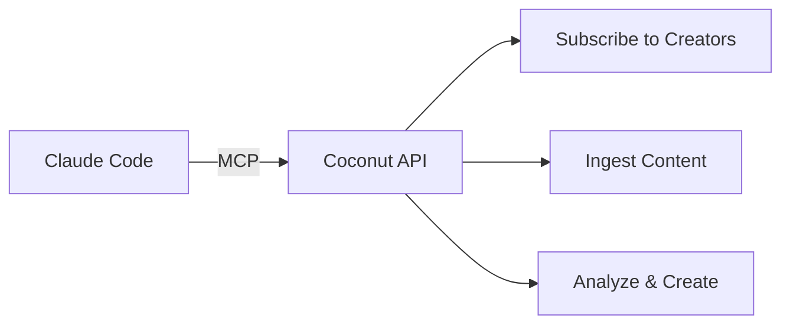

# Welcome to Coconut

Coconut is a **content intelligence platform** for personal branding. It helps you track creators, analyze content, and build your content library - all powered by AI.

## Claude Code Integration

Coconut integrates directly with [Claude Code](https://claude.ai/claude-code) via the **Model Context Protocol (MCP)**. This means you can:

<CardGroup cols={2}>
  <Card title="Subscribe to Creators" icon="user-plus">
    Follow creators across X, Instagram, TikTok, YouTube, and LinkedIn
  </Card>
  <Card title="Analyze Content" icon="brain">
    Get AI-powered analysis of hooks, structure, and writing style
  </Card>
  <Card title="Manage Your Digest" icon="inbox">
    Review and curate content from creators you follow
  </Card>
  <Card title="Create Content Blocks" icon="pen">
    Draft tweets, threads, newsletters, and more
  </Card>
</CardGroup>

## How It Works

1. **Connect** - Add Coconut as an MCP server in Claude Code
2. **Subscribe** - Follow creators whose content you want to track
3. **Ingest** - Coconut fetches their latest posts automatically
4. **Analyze** - Use AI to break down what makes their content work
5. **Create** - Draft your own content inspired by what you've learned

## Quick Links

<CardGroup cols={2}>
  <Card title="Quickstart" icon="rocket" href="/quickstart">
    Get set up in 2 minutes
  </Card>
  <Card title="MCP Tools Reference" icon="wrench" href="/mcp-tools/overview">
    Explore all 11 available tools
  </Card>
</CardGroup>
