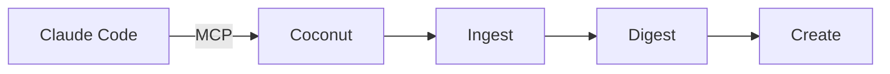

# Welcome to Coconut

> Post more without doing more. Escape the content treadmill with our intelligent content arbitrage system.

Coconut is a **brand builder's oasis** where content flows and creativity thrives. It's an intelligent content arbitrage system that helps creators post more without doing more work.

## The Problem

Building a brand is exhausting. The advice sounds simple—post more, be consistent, show up daily—but the reality leads to burnout, blank page anxiety, and endless grinding on the content treadmill.

## How Coconut Works

<Steps>
  <Step title="Ingest">
    Curate your subscriptions. These could be your favourite creators, competitors, or people talking about the things you want to talk about. We pull their content daily so you always have a fresh source of ideas.
  </Step>
  <Step title="Digest">
    We break down their posts and extract the good bits: hooks, structures, formats. These become your building blocks, all saved in your stash.
  </Step>
  <Step title="Create">
    Ready to post? Plunge into your stash and pick what's floating your boat. Remix, repurpose, and publish across channels in minutes.
  </Step>
</Steps>

## Why Coconut

<CardGroup cols={3}>
  <Card title="Content on Autopilot" icon="robot">
    Your stash fills up daily with fresh ideas from creators you follow. No more blank page. No more "what should I post today?"
  </Card>
  <Card title="Multi-Channel Presence" icon="share-nodes">
    One idea becomes content for X, LinkedIn, Instagram, and YouTube. Show up everywhere your audience is.
  </Card>
  <Card title="Effortless Scale" icon="rocket">
    Post ten times a day without ten times the work. Focus on what actually matters: being creative.
  </Card>
</CardGroup>

## Claude Code Integration

Coconut integrates directly with [Claude Code](https://claude.ai/claude-code) via the **Model Context Protocol (MCP)**. This means you can manage your entire content workflow through natural conversation:

- Subscribe to creators and ingest their content
- Browse and curate your digest
- Analyze what makes content work
- Draft tweets, threads, newsletters, and more

## Who It's For

<CardGroup cols={2}>
  <Card title="Human Builders" icon="user">
    SaaS Founders, Content Creators, GTM Leaders, Growth Hackers, B2B Startups, Brand Owners, Solopreneurs, Agencies
  </Card>
  <Card title="Agent Integration" icon="microchip">
    Works with Claude Code, Cursor, Windsurf, Aider, Cline, Goose, and other MCP-compatible tools
  </Card>
</CardGroup>

## Get Started

<CardGroup cols={2}>
  <Card title="Quickstart" icon="rocket" href="/quickstart">
    Connect Coconut to Claude Code in 2 minutes
  </Card>
  <Card title="MCP Tools Reference" icon="wrench" href="/mcp-tools/overview">
    Explore all 11 available tools
  </Card>
</CardGroup>
