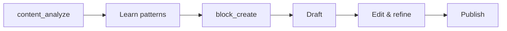

# block_create

Create a new content block (draft, note, tweet, thread, etc). Use for creating new content or deriving content from saved posts.

## Parameters

| Parameter | Type | Required | Description |
|-----------|------|----------|-------------|
| `kind` | string | Yes | Content type (see below) |
| `content` | string | Yes | The content text |
| `platform` | string | No | Target platform |
| `properties` | object | No | Additional metadata |
| `derivedFrom` | array | No | Content IDs this is derived from |

### Content Types (kind)

| Kind | Description |
|------|-------------|
| `note` | General note or idea |
| `tweet` | Single tweet/post |
| `thread` | Twitter/X thread |
| `linkedin` | LinkedIn post |
| `reel_script` | Instagram Reel script |
| `tiktok_script` | TikTok video script |
| `youtube_script` | YouTube video script |
| `newsletter` | Newsletter content |
| `carousel` | Carousel/slide content |

## Example

<CodeGroup>
```text Prompt
Create a tweet draft based on what I learned from levelsio's post about shipping fast
```

```json Response
{
  "block": {
    "id": "block-456",
    "kind": "tweet",
    "platform": "x",
    "content": "The best way to learn is to ship.\n\nStop waiting for perfect conditions.\nStop planning indefinitely.\nStop asking for permission.\n\nJust ship. Then iterate.\n\nYour 10th project will be better than your 1st.\nBut you need to ship those first 9.",
    "status": "draft",
    "isPublishable": true,
    "derivedFrom": ["content-123"],
    "createdAt": "2024-03-15T11:00:00Z"
  }
}
```
</CodeGroup>

## Response Fields

| Field | Type | Description |
|-------|------|-------------|
| `block.id` | string | Block UUID |
| `block.kind` | string | Content type |
| `block.platform` | string | Target platform |
| `block.content` | string | The content |
| `block.status` | string | `draft`, `scheduled`, `published`, `archived` |
| `block.isPublishable` | boolean | Ready to publish |
| `block.derivedFrom` | array | Source content IDs |
| `block.createdAt` | string | Creation timestamp |

## Use Cases

- Draft content inspired by analyzed posts
- Create threads from notes
- Build a content library for future publishing

## Workflow



## Related Tools

- [`content_analyze`](/mcp-tools/content-analyze) - Learn from existing content
- [`block_list`](/mcp-tools/block-list) - View all your blocks
