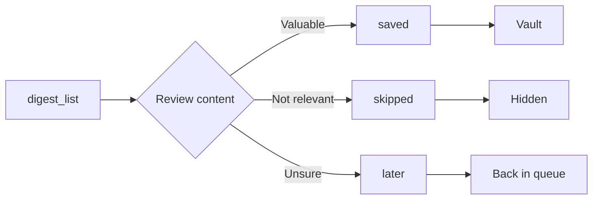

# digest_action

Record an action on a digest item. Use "saved" to add to vault, "skipped" to dismiss, or "later" to defer.

## Parameters

| Parameter | Type | Required | Description |
|-----------|------|----------|-------------|
| `contentId` | string (UUID) | Yes | Content ID from `digest_list` |
| `action` | string | Yes | One of: `saved`, `skipped`, `later` |

## Actions

| Action | Meaning |
|--------|---------|
| `saved` | Add to your vault for reference |
| `skipped` | Dismiss - not relevant |
| `later` | Come back to this later |

## Example

<CodeGroup>
```text Prompt
Save the post from levelsio about launching projects to my vault
```

```json Response
{
  "digestId": "digest-item-123",
  "action": "saved",
  "message": "Content saved to vault"
}
```
</CodeGroup>

## Response Fields

| Field | Type | Description |
|-------|------|-------------|
| `digestId` | string | Digest item UUID |
| `action` | string | Action taken |
| `message` | string | Human-readable confirmation |

## Use Cases

- Save valuable content for future reference
- Clear irrelevant content from digest
- Defer decisions on content you're unsure about

## Workflow



## Related Tools

- [`digest_list`](/mcp-tools/digest-list) - Get items to review
- [`content_analyze`](/mcp-tools/content-analyze) - Analyze before saving
