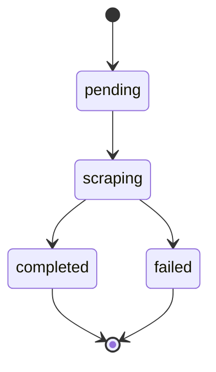

# ingestion_status

Check the status of an ingestion job. Returns progress, timing, and any errors.

## Parameters

| Parameter | Type | Required | Description |
|-----------|------|----------|-------------|
| `jobId` | string (UUID) | Yes | Ingestion job ID |

## Example

<CodeGroup>
```text Prompt
Check the status of ingestion job job-456
```

```json Response (In Progress)
{
  "job": {
    "id": "job-456",
    "creatorId": "550e8400-e29b-41d4-a716-446655440000",
    "handle": "levelsio",
    "platform": "x",
    "status": "scraping",
    "progress": {
      "postsRequested": 50,
      "postsFetched": 35,
      "postsDelivered": 15,
      "postsAnalyzed": 0
    },
    "timing": {
      "createdAt": "2024-03-15T10:00:00Z",
      "startedAt": "2024-03-15T10:00:05Z",
      "completedAt": null,
      "elapsedSeconds": 45
    }
  }
}
```

```json Response (Completed)
{
  "job": {
    "id": "job-456",
    "creatorId": "550e8400-e29b-41d4-a716-446655440000",
    "handle": "levelsio",
    "platform": "x",
    "status": "completed",
    "progress": {
      "postsRequested": 50,
      "postsFetched": 50,
      "postsDelivered": 50,
      "postsAnalyzed": 0
    },
    "timing": {
      "createdAt": "2024-03-15T10:00:00Z",
      "startedAt": "2024-03-15T10:00:05Z",
      "completedAt": "2024-03-15T10:01:30Z",
      "elapsedSeconds": 85
    }
  }
}
```

```json Response (Failed)
{
  "job": {
    "id": "job-456",
    "creatorId": "550e8400-e29b-41d4-a716-446655440000",
    "handle": "privatecreator",
    "platform": "x",
    "status": "failed",
    "progress": {
      "postsRequested": 50,
      "postsFetched": 0,
      "postsDelivered": 0,
      "postsAnalyzed": 0
    },
    "timing": {
      "createdAt": "2024-03-15T10:00:00Z",
      "startedAt": "2024-03-15T10:00:05Z",
      "completedAt": "2024-03-15T10:00:15Z",
      "elapsedSeconds": 10
    },
    "error": {
      "message": "Account is private",
      "retryable": false
    }
  }
}
```
</CodeGroup>

## Response Fields

| Field | Type | Description |
|-------|------|-------------|
| `job.id` | string | Job UUID |
| `job.creatorId` | string | Creator UUID |
| `job.handle` | string | Creator's handle |
| `job.platform` | string | Platform name |
| `job.status` | string | `pending`, `scraping`, `completed`, `failed` |

### progress

| Field | Type | Description |
|-------|------|-------------|
| `postsRequested` | number | Posts requested |
| `postsFetched` | number | Posts fetched so far |
| `postsDelivered` | number | Posts delivered to workspace |
| `postsAnalyzed` | number | Posts analyzed |

### timing

| Field | Type | Description |
|-------|------|-------------|
| `createdAt` | string | Job creation time |
| `startedAt` | string | Job start time |
| `completedAt` | string | Job completion time (null if running) |
| `elapsedSeconds` | number | Seconds since start |

### error (when failed)

| Field | Type | Description |
|-------|------|-------------|
| `message` | string | Error description |
| `retryable` | boolean | Whether retry may succeed |

## Job Status Flow



## Use Cases

- Monitor ingestion progress
- Check if content is ready to review
- Diagnose failed ingestions

## Related Tools

- [`ingestion_trigger`](/mcp-tools/ingestion-trigger) - Start ingestion
- [`digest_list`](/mcp-tools/digest-list) - Review fetched content
