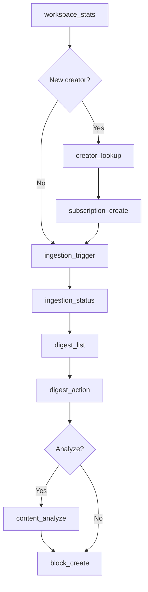

# MCP Tools

Coconut exposes 11 tools through the Model Context Protocol. Claude Code can call these tools directly to manage your content workflow.

## Tool Categories

<CardGroup cols={2}>
  <Card title="Workspace" icon="house">
    Get workspace stats and plan limits
  </Card>
  <Card title="Creators" icon="users">
    Look up and subscribe to creators
  </Card>
  <Card title="Ingestion" icon="download">
    Trigger and monitor content fetching
  </Card>
  <Card title="Digest" icon="inbox">
    Review and curate content
  </Card>
  <Card title="Analysis" icon="brain">
    AI-powered content analysis
  </Card>
  <Card title="Blocks" icon="pen">
    Create and manage your content
  </Card>
</CardGroup>

## All Tools

| Tool | Description |
|------|-------------|
| [`workspace_stats`](/mcp-tools/workspace-stats) | Get workspace overview, stats, and plan limits |
| [`creator_lookup`](/mcp-tools/creator-lookup) | Look up a creator by platform and handle |
| [`subscription_create`](/mcp-tools/subscription-create) | Subscribe to a creator |
| [`subscription_list`](/mcp-tools/subscription-list) | List all subscriptions |
| [`ingestion_trigger`](/mcp-tools/ingestion-trigger) | Trigger content ingestion |
| [`ingestion_status`](/mcp-tools/ingestion-status) | Check ingestion job status |
| [`digest_list`](/mcp-tools/digest-list) | Get unactioned content |
| [`digest_action`](/mcp-tools/digest-action) | Record action on digest item |
| [`content_analyze`](/mcp-tools/content-analyze) | AI-analyze a piece of content |
| [`block_create`](/mcp-tools/block-create) | Create a content block |
| [`block_list`](/mcp-tools/block-list) | List content blocks |

## Common Patterns

### Supported Platforms

All tools that accept a `platform` parameter support:

- `x` - X (Twitter)
- `instagram` - Instagram
- `tiktok` - TikTok
- `youtube` - YouTube
- `linkedin` - LinkedIn

### Pagination

Tools that return lists support pagination:

```json
{
  "limit": 20,    // Items per page (1-100, default varies)
  "offset": 0     // Items to skip
}
```

Response includes pagination metadata:

```json
{
  "pagination": {
    "total": 150,
    "limit": 20,
    "offset": 0,
    "hasMore": true
  }
}
```

### Error Responses

All tools return errors in a consistent format:

```json
{
  "error": {
    "code": "not_found",
    "message": "Creator not found",
    "suggestion": "Check the handle spelling"
  }
}
```

Common error codes:

| Code | Meaning |
|------|---------|
| `not_found` | Resource doesn't exist |
| `already_exists` | Duplicate resource |
| `limit_exceeded` | Plan limit reached |
| `service_error` | Internal service failure |
| `internal_error` | Unexpected error |

## Typical Workflow



1. **Start**: Check `workspace_stats` to see your limits
2. **Subscribe**: Use `creator_lookup` + `subscription_create` for new creators
3. **Ingest**: Trigger `ingestion_trigger`, check with `ingestion_status`
4. **Review**: Browse `digest_list`, take actions with `digest_action`
5. **Create**: Use `content_analyze` to learn, then `block_create` to draft
